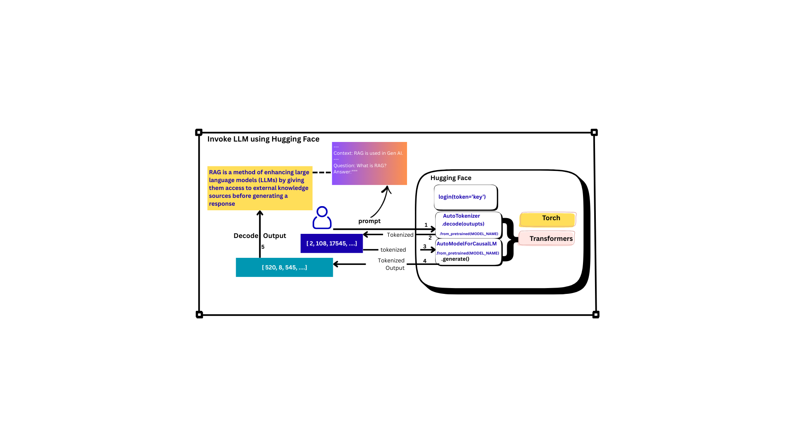

# Setup Local Environment

python -m venv venv

venv\Scripts\activate

set HF_HOME="E:\ExtendedPrograms\CachedLibs"
model1 = AutoModelForCausalLM.from_pretrained(MODEL_NAME,cache_dir="E:\ExtendedPrograms\CachedLibs").to(device)
  

------

# RAG Design Pattern
**The Retrieval-Augmented Generation (RAG)** design pattern is an artificial intelligence (AI) framework that enhances large language models (LLMs) by giving them access to external, up-to-date, and domain-specific information before generating a response. This process helps mitigate common LLM issues like generating false information (hallucinations), providing outdated knowledge, or lacking expertise on proprietary data. 

-------
The RAG pattern operates in two main stages: 
**The RAG Workflow**

**Retrieval**: When a user submits a query, the RAG system first converts the query into a numerical representation (a vector embedding). This embedding is used to search a specialized knowledge base (typically a vector database containing vectorized documents, PDFs, or other data) to find the most relevant document snippets or passages.

**Augmentation & Generation**: The retrieved, relevant information is then added to the user's original prompt as additional context. This augmented prompt is sent to the LLM, which uses both its inherent training data and the new, specific context to generate a grounded, accurate, and relevant answer. 

**Key Benefits**

**Improved Accuracy and Trust**: By grounding responses in specific, verifiable sources, RAG significantly reduces the risk of the model "hallucinating" or presenting incorrect facts.
**Up-to-Date Information**: RAG allows LLMs to use the latest data (e.g., live news feeds, recent company policies) without the need for expensive and time-consuming model retraining.
**Domain-Specific Expertise**: It enables general-purpose LLMs to become experts on an organization's private or niche data, making them useful for internal knowledge management or specialized customer support.
**Cost-Effectiveness**: RAG is a more efficient and scalable way to adapt LLMs to new information compared to fine-tuning or training models from scratch. 

Common Design Patterns
------
Beyond the basic RAG workflow, several advanced patterns exist for more complex use cases: 

**Simple RAG**: The foundational, linear process of retrieve-then-generate, suitable for basic question-answering systems.

**RAG with Memory**: Incorporates chat history to maintain context across multi-turn conversations, ideal for chatbots and assistants.

**Multi-hop RAG**: For complex questions requiring deep reasoning, this pattern performs multiple, chained retrieval steps, where the output of one search informs the next.

**Agentic RAG**: The most sophisticated pattern, where an autonomous AI agent dynamically decides which tools or data sources to use, breaks down complex tasks into sub-queries, and orchestrates the information gathering process.

**Corrective RAG (CRAG)**: Includes a self-reflection mechanism that evaluates the quality of retrieved documents and performs additional searches if the initial information is insufficient or irrelevant. 

